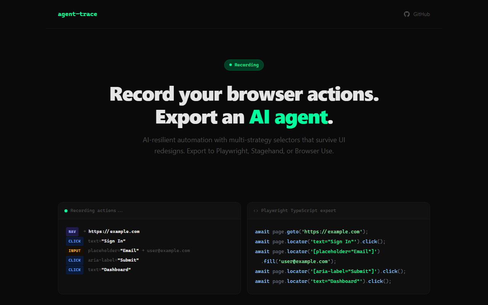

# AgentTrace

**Live:** https://agent-trace-sage.vercel.app



Record your browser actions. Export an AI-resilient automation script.

## How It Works

1. Install the Chrome extension
2. Click "Record" and use the website normally
3. Click "Stop" and export as Playwright, Stagehand, or Browser Use

## Why Not Playwright Codegen?

Playwright's recorder outputs brittle CSS selectors that break when the UI changes. AgentTrace generates **multiple selector strategies** ranked by resilience:

| Strategy | Example | Resilience |
|----------|---------|------------|
| test-id | `[data-testid="submit-btn"]` | Highest |
| text | `text="Sign In"` | High |
| aria | `[aria-label="Submit"]` | High |
| css | `button.btn-primary` | Low |

Your exported scripts survive UI redesigns because they target **meaning**, not **structure**.

## Export Formats

### Playwright (TypeScript)
```typescript
import { test } from '@playwright/test';

test('recorded flow', async ({ page }) => {
  await page.goto('https://example.com');
  await page.locator('text=Sign In').click();
  await page.locator('[placeholder="Email"]').fill('user@example.com');
});
```

### Stagehand (TypeScript)
```typescript
import { Stagehand } from '@browserbasehq/stagehand';

async function main() {
  const stagehand = new Stagehand();
  await stagehand.init();
  await stagehand.act('Click on "Sign In"');
  await stagehand.act('Type "user@example.com" into "Email"');
}
```

### Browser Use (Python)
```python
from browser_use import Agent
from langchain_openai import ChatOpenAI

agent = Agent(
    task="Go to example.com, click Sign In, enter user@example.com",
    llm=ChatOpenAI(model="gpt-4o"),
)
```

## Features

- **Multi-strategy selectors** - text, ARIA, test-id, CSS (ranked by resilience)
- **Visual feedback** - green highlight on recorded elements, recording badge
- **3 export formats** - Playwright, Stagehand, Browser Use
- **JSON export** - raw recording data for custom processing
- **Action editing** - delete individual actions from the popup
- **Input debouncing** - captures final value, not every keystroke
- **Navigation tracking** - automatic page transition recording

## Development

```bash
git clone https://github.com/m4cd4r4/agent-trace
cd agent-trace
npm install
npm run build
```

Then load `dist/` as an unpacked extension in Chrome:
1. Go to `chrome://extensions`
2. Enable "Developer mode"
3. Click "Load unpacked"
4. Select the `dist` folder

## Architecture

```
extension/
  manifest.json          # Chrome MV3 manifest
  popup/                 # Extension popup UI
    popup.html/ts/css    # Action list, controls, export buttons
  content/               # Injected into web pages
    recorder.ts          # Click/input/select event capture
    selector.ts          # Multi-strategy selector generation
    highlighter.ts       # Visual overlay and recording badge
  background/            # Service worker (state management)
    service-worker.ts    # Recording state, action storage, messaging
  shared/                # Shared types and export engines
    types.ts             # RecordedAction, SelectorStrategy
    export-playwright.ts # Playwright TypeScript generator
    export-stagehand.ts  # Stagehand TypeScript generator
    export-browser-use.ts # Browser Use Python generator
```

## License

MIT
